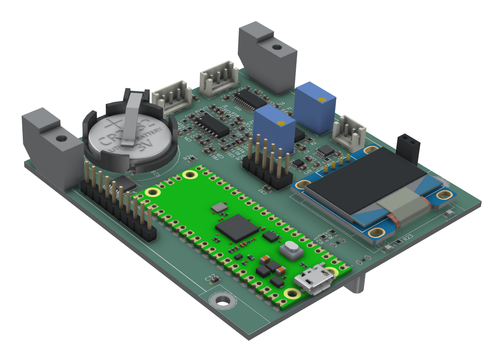

# PCSK225-PICO2 SDR Receiver

<ul>
<li>2025-08-27 - Documentation</li>
<li>2025-02-25 - First version of the project</li>
</ul>

## Overview

PCSK225-PICO2 is a compact, low‑cost software defined receiver designed to decode the 225 kHz Polish time signal transmitted from Solec Kujawski. The design is built around the Raspberry Pi Pico 2 (RP2350) module and supports two signal acquisition paths:

- Direct sampling with a high‑speed external ADC (ADS7049)
- Optional SSB down‑conversion using a Si4537‑D60 tuner, enabling baseband sampling with the RP2350’s internal ADC

 

The board integrates a precision RTC, local display, I/O expansion, audio output, and multiple user I/Os, making it a self‑contained platform for time‑signal experiments and SDR development.

## Key Features

- MCU: Raspberry Pi Pico 2 (RP2350) module
- Direct RF sampling: ADS7049 12‑bit, high‑speed SPI ADC connected to the RP2350 (supports ~225 kHz IF/baseband sampling)
- Optional tuner: Si4537‑D60 for SSB-style down‑conversion to low IF/baseband for sampling by the RP2350 internal ADC
- RF front end:
    - Active 6‑pole Butterworth band‑pass amplifier around TLV9064 (U2) centered on 225 kHz
    - Output/driver amplifier for Si4537 based on TLV9062 (U1)
    - TMUX1204 analog multiplexer (IC1) for flexible signal routing between ADCs and front‑end nodes
- Timing: DS3231 RTC with CR2032 backup battery for stable timekeeping and 1 Hz/32 kHz outputs
- Displays:
    - On‑board 0.96" I2C OLED (SSD1306)
    - Header for an external graphic LCD
- I/O expansion and storage:
    - PCA9500 I2C port expander with integrated EEPROM for configuration storage
- Connectivity and power:
    - Micro‑USB (Pico 2)
    - USB‑C connector for powering the receiver and PC connectivity
- User I/O:
    - 8 general‑purpose digital I/O lines on headers
    - PWM‑driven speaker/buzzer output with buffer stage
- Form factor: single PCB with Pico 2 module, mounting holes, and on‑board connectors
- See pcb.jpg for a 3D view of the assembled board

## Signal Paths

- Direct 225 kHz path:

1) Antenna/RF input → active BPF (U2 TLV9064) → analog mux (IC1) → ADS7049 → RP2350 via SPI/DMA
2) Intended for coherent sampling/decoding of the Polish 225 kHz time code
- Optional SSB/down‑conversion path:

1) RF input → Si4537‑D60 → low‑IF/baseband → output amplifier (U1 TLV9062) → RP2350 internal ADC
2) Useful for alternative demodulation modes and experiments

## Subsystem Details

- Active BPF: 6‑pole Butterworth around 225 kHz using TLV9064 quad op‑amp, input protection, and gain‑setting network
- Analog MUX: TMUX1204 routes filtered RF to the external ADC or other measurement points
- External ADC: ADS7049 low‑latency, SPI, suited for continuous streaming to RP2350 (DMA recommended)
- RTC: DS3231SN provides INT/SQW and 32 kHz outputs; backed by CR2032 cell
- Displays:
    - SSD1306 OLED on I2C bus (address configurable via jumpers)
    - External LCD header with SPI/I2C signals as routed on the schematic
- I2C Expander/EEPROM: PCA9500 provides extra GPIO and non‑volatile storage for calibration and user settings
- Audio: small speaker output driven from MCU PWM through a buffer (74LVC1G34) and filtering
- Power:
    - 3V3 rail with local decoupling (X5R/COG capacitors as noted)
    - USB‑C and Micro‑USB power options; VSYS routed to Pico 2
    - Ferrite bead and RC elements for analog rail cleanliness

## Firmware Notes

- Platform: Arduino core for RP2040/RP2350 or Pico SDK (C/C++)
- Recommended peripherals:
    - SPI DMA for ADS7049 streaming
    - PIO or timers for precise sampling clocks if needed
    - I2C for OLED, RTC, and PCA9500
    - PWM for speaker/buzzer output
- Example tasks:
    - 225 kHz band‑limited sampling and digital demodulation/decoding (e‑Czas/time code)
    - SSB/low‑IF capture via Si4537 with on‑chip ADC
    - UTC timekeeping using DS3231 and PPS alignment

## Connectors and Interfaces

- Pico 2 module header exposes GP0…GP21, ADC pins, SWD, 3V3, VBUS, VSYS
- OLED I2C header and external LCD header
- USB‑C and Micro‑USB
- 8x GPIO header for user applications
- RF input and test headers as shown on the schematic
- Speaker/buzzer connector

## Bill of Main ICs

- RP2350 (Raspberry Pi Pico 2 module)
- ADS7049 (external high‑speed ADC)
- Si4537‑D60 (optional tuner/down‑converter)
- TLV9064 (quad op‑amp, BPF and buffering)
- TLV9062 (dual op‑amp, output driver)
- TMUX1204 (analog multiplexer)
- DS3231SN (RTC)
- PCA9500 (I2C GPIO expander + EEPROM)
- SSD1306 (OLED controller)

## Status

- Hardware: Rev. 2 schematic/PCB
- Image: see pcb.jpg for the assembled PCB render
- Firmware: work in progress

## License

- Hardware and firmware: A permissive license similar to the BSD 2-Clause License, but with a 3rd clause that prohibits others from using the name of the copyright holder or its contributors to promote derived products without written consent.

## Acknowledgements

- Designed by KJK Innovations for research and development of low‑frequency time‑signal receivers and SDR experimentation.

